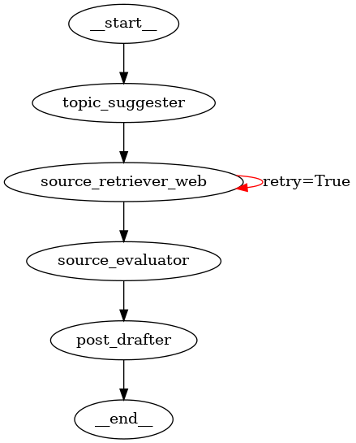

# Agente Intelligente per Blog di Viaggi in Moto

## Descrizione

Questo progetto implementa un sistema multi-agente basato su LangGraph per la generazione automatica di contenuti per un blog dedicato ai viaggi in moto. Il sistema utilizza un'architettura a grafo per orchestrare agenti specializzati che collaborano nella creazione di post originali, informativi e ben documentati.

Sviluppato come progetto per il corso di Cognitive Computing and Artificial Intelligence presso l'Università degli Studi di Catania (A.A. 2024-2025).

## Funzionalità

- **Generazione di argomenti originali** per tre tipologie di post:
  - Eventi motociclistici imminenti
  - Guide pratiche per viaggiatori
  - Recensioni di prodotti e accessori
  
- **Prevenzione delle ripetizioni** attraverso:
  - Storage persistente dello storico argomenti
  - Rilevamento di argomenti duplicati
  - Comparazione fuzzy per identificare similarità
  
- **Ricerca e valutazione fonti**:
  - Integrazione con SerpAPI per raccolta dati reali
  - Valutazione multi-criterio (rilevanza, autorevolezza, attualità, utilità)
  - Meccanismo di retry per affinare ricerche insufficienti
  
- **Redazione automatica** di bozze strutturate con:
  - Introduzione accattivante
  - Corpo informativo basato sulle fonti validate
  - Conclusione efficace
  - Limitazione di lunghezza per migliorare leggibilità

## Architettura



Il sistema implementa un grafo diretto con quattro nodi principali:

1. **Topic Suggester**: Interagisce con l'utente per selezionare la categoria e genera argomenti originali
2. **Source Retriever**: Interroga SerpAPI per raccogliere fonti web rilevanti 
3. **Source Evaluator**: Analizza e valuta la qualità delle fonti raccolte
4. **Post Drafter**: Sintetizza le informazioni in una bozza strutturata

L'architettura utilizza routing condizionale per gestire casi di ricerca insufficiente e migliorare iterativamente i risultati.

## Requisiti

- Python 3.9+
- LangGraph 
- LangChain
- OpenAI API key
- SerpAPI key (configurata come variabile d'ambiente `SERPAPI_API_KEY`)

## Installazione

```bash
# Clone del repository
git clone https://github.com/yourusername/moto-blog-agent.git
cd moto-blog-agent

# Installazione dipendenze
pip install -r requirements.txt

# Configurazione API keys
export OPENAI_API_KEY=your_openai_api_key
export SERPAPI_API_KEY=your_serpapi_api_key
```

## Utilizzo

```bash
python agent.py
```

Segui le istruzioni a schermo per selezionare la categoria di post desiderata e lascia che il sistema generi automaticamente il contenuto.

## Struttura del Progetto

```
.
├── agent.py           # Implementazione principale degli agenti e del grafo
├── prompt.py          # Definizione dei prompt per i vari tipi di contenuto
├── themes.py          # Collezioni di temi per guide e recensioni
├── topic_history.json # Storico degli argomenti per prevenire ripetizioni
├── graph.png          # Rappresentazione visuale del grafo di agenti
└── README.md          # Documentazione del progetto
```

## Flusso di Esecuzione

1. L'utente seleziona la categoria di post (o sceglie di lasciare decidere all'agente)
2. Il sistema genera un argomento originale verificando la non ripetitività
3. Il sistema formula e invia query di ricerca per raccogliere fonti pertinenti
4. Le fonti vengono analizzate e valutate secondo criteri multipli
5. Viene redatta una bozza di post strutturata basata sulle fonti di qualità
6. Il risultato finale viene presentato all'utente

## Autori

- Giovanni Ragusa
- Daniele Lucifora

## Sviluppi Futuri

- Implementazione di un sistema di revisione human-in-the-loop
- Interfaccia web per un'interazione più immediata
- Supporto per la pianificazione di serie di contenuti correlati
- Integrazione con strumenti di ottimizzazione SEO
- Supporto multilingua

## Licenza

MIT License
